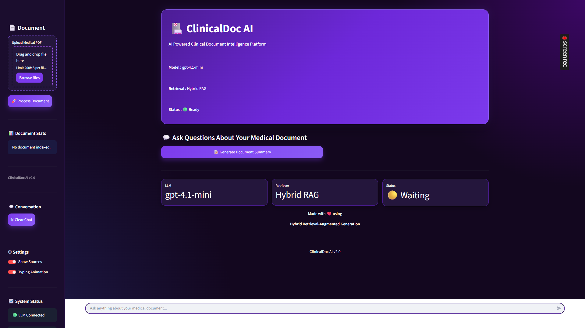
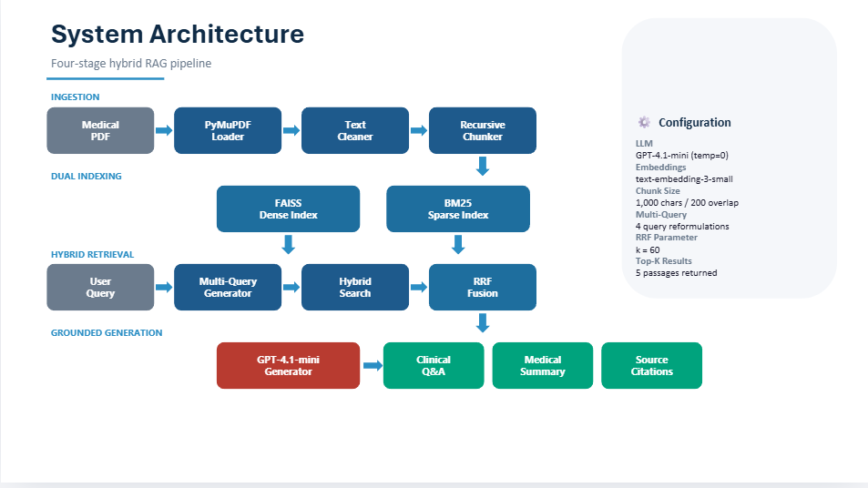
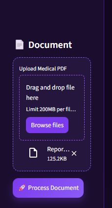
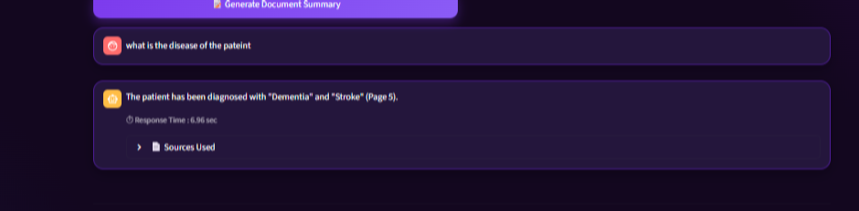
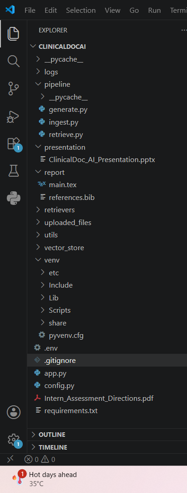

# 🏥 ClinicalDoc AI

<div align="center">

### AI-Powered Clinical Document Intelligence Platform

**Advanced Hybrid Retrieval-Augmented Generation (Hybrid RAG) for Healthcare**

[]()
[]()
[]()
[]()
[]()
[]()

*A next-generation clinical document assistant designed to help healthcare professionals retrieve, summarize, and understand medical documents using Hybrid RAG.*

</div>

---

# 📸 Application Preview

<p align="center">

</p>

---

# 🚀 What is ClinicalDoc AI?

ClinicalDoc AI is an intelligent healthcare document assistant that allows users to upload medical PDFs and interact with them using natural language.

Instead of performing simple keyword search, the system uses an **Advanced Hybrid Retrieval-Augmented Generation (Hybrid RAG)** pipeline combining semantic search, lexical search, Multi-Query Generation and Reciprocal Rank Fusion.

Every generated response is grounded with **page-level citations**, making the answers transparent and trustworthy.

---

# ✨ Key Features

- 📄 Medical PDF Upload
- 🤖 AI Clinical Question Answering
- 📝 Automatic Medical Document Summary
- 🔍 Hybrid Retrieval (BM25 + FAISS)
- 🧠 Multi-Query Generation
- 🎯 Reciprocal Rank Fusion (RRF)
- 📚 Page-Level Source Citation
- ⚡ Semantic + Keyword Search
- 💬 Natural Language Interface
- 📊 Document Statistics
- 🗂 Conversation History
- 📥 Download Chat
- 🌙 Modern Streamlit UI
- 🩺 Healthcare Focused

---

# 🏗️ System Architecture

<p align="center">

</p>

### Pipeline

```text
Medical PDF
      │
      ▼
Document Cleaning
      │
      ▼
Recursive Chunking
      │
      ▼
Hybrid Indexing
      │
      ├─────────────► BM25
      │
      └─────────────► FAISS
                    │
                    ▼
        Multi Query Generation
                    │
                    ▼
      Reciprocal Rank Fusion
                    │
                    ▼
            GPT-4.1 Mini
                    │
                    ▼
 Grounded Clinical Answer + Citations
```

---

# ⚙️ Workflow

1. Upload Medical PDF
2. Process Document
3. Build Hybrid Index
4. Generate Multiple Queries
5. Retrieve using BM25 & FAISS
6. Merge Results using RRF
7. Generate Grounded Answer
8. Show Page-Level Citation

---

# 🧠 Why This Isn't a Basic RAG?

Unlike traditional RAG systems, ClinicalDoc AI focuses on improving retrieval quality before answer generation.

### Semantic Retrieval

✅ FAISS

### Lexical Retrieval

✅ BM25

### Query Expansion

✅ Multi-Query Generation

### Ranking

✅ Reciprocal Rank Fusion

This architecture provides significantly stronger retrieval quality and reduces the chances of missing relevant clinical information.

---

# 📷 Upload & Process Document

<p align="center">

</p>

Users can upload a medical PDF and process it with a single click.

The system automatically performs cleaning, chunking, indexing and document preparation.

---

# 💬 Clinical Question Answering

<p align="center">

</p>

Users can ask questions in natural language.

The system retrieves relevant medical evidence before generating the answer.

---

# 📄 Grounded Response

<p align="center">

</p>

Every answer includes page-level citations from the uploaded document, improving transparency and trust.

---

# 💻 Tech Stack

### AI

- GPT-4.1 Mini
- OpenAI Embeddings
- LangChain

### Retrieval

- Hybrid RAG
- FAISS
- BM25
- Multi Query Generation
- Reciprocal Rank Fusion

### Backend

- Python
- Streamlit

### PDF Processing

- PyMuPDF
- RecursiveCharacterTextSplitter

---

# 📁 Project Structure

<p align="center">

</p>

```text
ClinicalDocAI/
│
├── pipeline/
│   ├── ingest.py
│   ├── retrieve.py
│   └── generate.py
│
├── retrievers/
├── utils/
├── vector_store/
├── uploaded_files/
├── report/
├── presentation/
│
├── app.py
├── config.py
├── requirements.txt
└── README.md
```

---

# 🎯 Healthcare Use Cases

- Clinical Document Review
- Payment Integrity
- Medical Coding Assistance
- Utilization Management
- Medical Record Search
- Clinical Decision Support
- Healthcare Documentation
- Intelligent Medical Search

---

# 🚀 Future Improvements

- ICD-10 Auto Coding
- CPT Extraction
- Medical Entity Recognition
- HIPAA-ready Deployment
- Agentic Clinical Workflow
- Voice-based Clinical Assistant
- Multi-document Comparison
- Medical Knowledge Graph

---

# 👨‍💻 Developed By

## Snehil Yadav

Machine Learning Engineer | Generative AI | Hybrid RAG | LLM Applications

---

⭐ If you found this project interesting, don't forget to give it a star!